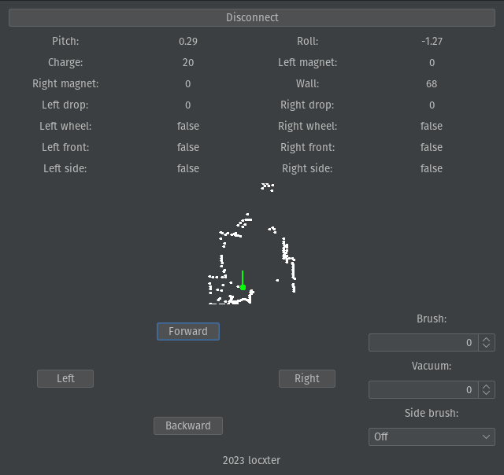

# btvccntrl-ng

## Overview

This is the next generation rewrite of [btvccntrl](https://github.com/locxter/btvccntrl), which is a GUI program for controlling Neato Botvac D85 robot vacuums.

## Dependencies

I generally try to minimize dependencies, but I'm a one man crew and can therefore only support Debian-based Linux distributions as I'm running one myself. Anyway, you need to have the following packages installed for everything to work properly:

- SDKMAN! for managing all the JVM dependencies. Install it via the [installation guide](https://sdkman.io/install).
- JDK for running the bytecode. Install it with `sdk install java`.
- Kotlin for developing the program. Install it with `sdk install kotlin`.
- Gradle for building the whole thing. Install it with `sdk install gradle`.

## How to use it

Build the JAR via `gladle clean standalone` and then run it via `java -jar build/libs/btvccntrl-ng-1.0-standalone.jar`.
